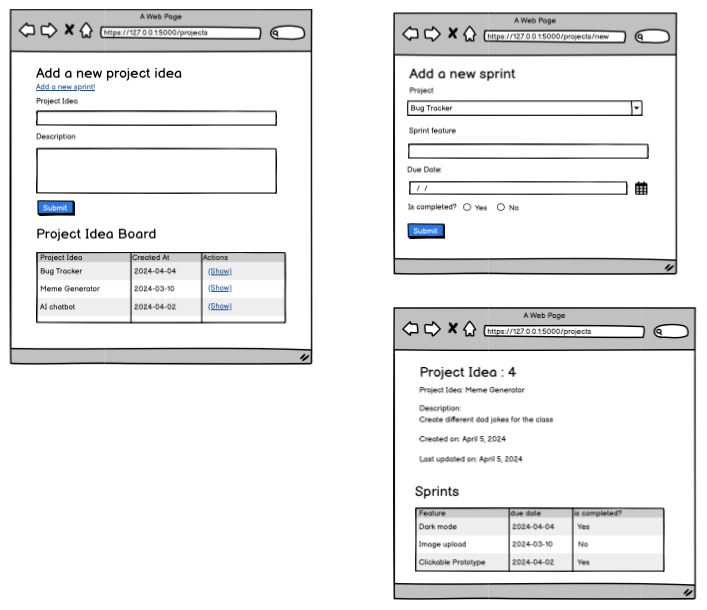

# One to many Notes


## Setup 
Follow [MVC notes](./mvc1-crud/readme.md)

## Create with a foreign key (Sprint with project_id)
What is new?
- Controller: Add the project_list from database if you need to pick a project from the list
- Templates: Make sure the project_id is matching the foreign key in that table
  ```html
    <select name="project_id" class="form-select">
        
        <option value="{{each_project.id}}">{{each_project.idea}}</option>
        
    </select>
  ```

## Project Details page with a list of sprints
What is new?
### model
Constructor: added ```self.sprints = []```

### get_one_with_sprints(cls, id)
- Query:  LEFT JOIN the other table and added the WHERE condition
  ```sql
    SELECT * FROM projects
    LEFT JOIN sprints ON projects.id = sprints.project_id
    WHERE projects.id = 1;        
  ```

- After getting the results, create an instance with the first row (results[0])
- Loop through each row, store it in a temp dictionary 
  ```py
    ###### BOTH OPTIONS WORK BUT PICK ONLY ONE ########
    # option 1: (same as the platform)
    sprint_dict = {
        "feature": row["feature"],
        "due_date" : row["due_date"],
        "is_completed": row["is_completed"],
        "project_id": row["project_id"],
        "id" : row["sprints.id"],
        "created_at": row["sprints.created_at"],
        "updated_at": row["sprints.updated_at"]
    }

    # option 2: **row will match all the matching keys 
    sprint_dict = {
        **row,
        "id" : row["sprints.id"],
        "created_at": row["sprints.created_at"],
        "updated_at": row["sprints.updated_at"]
    }
  ```
- Create a Sprint instance as it goes ```each_sprint = Sprint(sprint_dict)```
- Push the newly created sprint instance to project.sprints
- return project

### Templates & Controllers
project from model (get_one_with_sprints)
```js
    project = {
        "id" : 1,
        "idea" : "Bug Tracker",
        "description": "Very cool",
        "created_at":"2024-04-11 10:44:53",
        "updated_at":"2024-04-11 10:44:53",
        "sprints": [
            {
                "id" : 1,
                "feature": "dark mode",
                "due_date": "2024-04-20",
                "is_completed": 1,
                "created_at":"2024-04-11 11:10:24",
                "created_at":"2024-04-11 11:10:24",
            },
            {
                "id" : 4,
                "feature": "AI powered",
                "due_date": "2024-04-25",
                "is_completed": 0,
                "created_at":"2024-04-11 11:23:12",
                "created_at":"2024-04-11 11:23:12",
            }
        ]
    }
```
In the templates, you do not need to have another query for the list of sprints
- loop through project.sprints and you get the list of related sprints